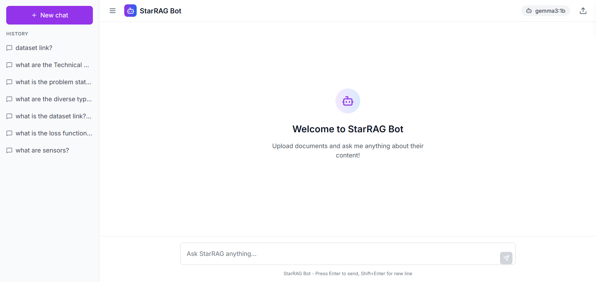

# StarRAG Bot

StarRAG Bot is a full-stack web application that allows you to chat with your documents using a local Retrieval-Augmented Generation (RAG) pipeline. It leverages the power of local language models through Ollama, ensuring your data remains private and secure on your own machine.

 <!-- You can add a screenshot of your app here -->

## Features

- **Local First**: All processing and model inference happens locally. No data is sent to the cloud.
- **Document Upload**: Supports uploading various document formats (`.txt`, `.pdf`, `.docx`).
- **Chat Interface**: An intuitive chat interface to ask questions about your uploaded documents.
- **Persistent Conversations**: Chat history is saved and can be revisited later.
- **Powered by Ollama**: Easily switch between different local language models supported by Ollama.

## Tech Stack

- **Frontend**: React, Vite, Tailwind CSS
- **Backend**: Python, Flask, LangChain
- **Vector Store**: FAISS (for local similarity search)
- **LLM Provider**: Ollama (running models like `gemma3:1b`)

## Prerequisites

Before you begin, ensure you have the following installed on your system:

- [Node.js](https://nodejs.org/) (v18 or later recommended)
- [Python](https://www.python.org/downloads/) (v3.10 or later recommended)
- [Ollama](https://ollama.com/): Follow the instructions on their website to install it for your operating system.

## Setup and Installation

1.  **Clone the repository:**
    ```bash
    git clone <your-repository-url>
    cd local-rag-bot
    ```

2.  **Install Backend Dependencies:**
    Navigate to the `backend` directory and install the required Python packages.
    ```bash
    cd backend
    pip install -r requirements.txt
    ```

3.  **Install Frontend Dependencies:**
    Navigate to the `frontend` directory and install the required Node.js packages.
    ```bash
    cd ../frontend
    npm install
    ```

4.  **Set up Ollama and Download a Model:**
    First, ensure the Ollama application is running. Then, pull the model you wish to use. This project is configured to use `gemma3:1b` by default.
    ```bash
    ollama pull gemma3:1b
    ```

## Running the Application

To run the application, you'll need to start both the backend and frontend servers. A `concurrently` script is set up in the root `package.json` to make this easy.

From the **root directory** of the project, run:

```bash
npm start
```

This command will:
- Start the Flask backend server on `http://localhost:5000`.
- Start the React frontend development server on `http://localhost:5173`.

Your browser should automatically open to the application. If not, navigate to `http://localhost:5173`.

## Project Structure

```
local-rag-bot/
├── backend/          # Flask backend, RAG pipeline, API endpoints
│   ├── app.py        # Main Flask application
│   ├── requirements.txt
│   └── ...
├── frontend/         # React frontend application
│   ├── src/
│   └── ...
├── package.json      # For running both servers concurrently
└── README.md         # This file
```
